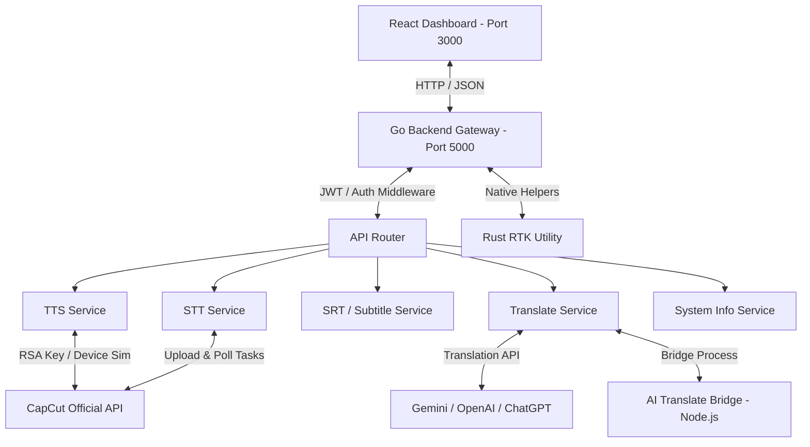

# Cấu Trúc Dự Án CapCut Studio Portable (Unified Edition)

Tài liệu này mô tả chi tiết sơ đồ thư mục, cấu trúc giao tiếp giữa các thành phần và vai trò/chức năng kèm số dòng code thực tế của các tệp tin trong hệ thống **CapCut Studio Portable**.

---

## 1. Bản Đồ Tổng Quan Thư Mục (ASCII Tree)

```text
Capcut tool/
├── services/                        # Các dịch vụ xử lý ngầm (Backend & Automation Bridge)
│   ├── go-backend/                  # API Gateway trung tâm bằng Go (Port: 5000)
│   │   ├── api/                     # Định tuyến đường dẫn API (Router)
│   │   ├── cmd/                     # Điểm khởi động hệ thống
│   │   ├── internal/                # Cấu hình nội bộ (Config, Logger, HTTP Helpers)
│   │   ├── middleware/              # Bộ lọc bảo mật (JWT, Rate Limiting, CORS) & Request Logger
│   │   └── services/                # Các dịch vụ xử lý (TTS, STT, SRT, Translate, System, Cache)
│   ├── ai-translate-bridge/         # Cầu nối tự động hóa dịch thuật bằng Node/TypeScript/Puppeteer
│   └── capcut-tts-api/              # Thư viện & Client Python giao tiếp với API gốc của CapCut
│
├── ui/                              # Lớp giao diện người dùng (Frontend)
│   └── portable-app/                # Giao diện React + Vite + Tailwind (Port: 3000)
│       └── src/
│           ├── store/               # Zustand state stores (editor, system, translate)
│           ├── dashboard/           # Bảng điều khiển chính
│           │   ├── components/      # Các widget / React component dùng chung
│           │   ├── layouts/         # Layout khung (Sidebar, Header)
│           │   └── pages/           # Trang tính năng (Home, STT, Subtitle, Voice, Translate, System)
│           ├── App.tsx              # Router & Entry Point chính của UI
│           └── main.tsx             # Khởi tạo React DOM
│
├── rtk/                             # Rust-based Toolkit (RTK) xử lý hệ thống và hiệu năng cao
├── projects/                        # Thư mục lưu trữ dữ liệu dự án video cục bộ
└── agent-skills/                    # Tập hợp các kỹ năng tự động hóa và phát triển của AI Agent
```

---

## 2. Sơ Đồ Kiến Trúc Hệ Thống (System Architecture)

Sơ đồ dưới đây biểu diễn luồng giao tiếp giữa Frontend, Go Backend và các dịch vụ bổ trợ:



---

## 3. Chi Tiết File Nghiệp Vụ Backend (`services/go-backend`)

| Đường dẫn tệp tin | Chức năng chính / Vai trò | Số dòng code |
| :--- | :--- | :---: |
| [`main.go`](file:///c:/Users/ASUS%20ROD/Downloads/Capcut%20tool/services/go-backend/main.go) | Khởi chạy máy chủ HTTP API Gateway bảo mật trên cổng 5000. | 104 |
| [`api/router.go`](file:///c:/Users/ASUS%20ROD/Downloads/Capcut%20tool/services/go-backend/api/router.go) | Đăng ký toàn bộ các endpoint API công khai và bảo mật. | 87 |
| [`middleware/auth.go`](file:///c:/Users/ASUS%20ROD/Downloads/Capcut%20tool/services/go-backend/middleware/auth.go) | Xác thực mã khóa API cục bộ (`X-API-Key`) và JWT Token. | 103 |
| [`middleware/security.go`](file:///c:/Users/ASUS%20ROD/Downloads/Capcut%20tool/services/go-backend/middleware/security.go) | Quản lý chính sách CORS, bảo mật CSRF và giới hạn Rate Limiting. | 119 |
| [`middleware/logger.go`](file:///c:/Users/ASUS%20ROD/Downloads/Capcut%20tool/services/go-backend/middleware/logger.go) | Ghi log thời gian phản hồi (latency) và trạng thái các HTTP request. | 31 |
| [`services/device.go`](file:///c:/Users/ASUS%20ROD/Downloads/Capcut%20tool/services/go-backend/services/device.go) | Tạo lập thông tin thiết bị ảo và tạo chữ ký RSA để tương tác với API CapCut. | 175 |
| [`services/stt.go`](file:///c:/Users/ASUS%20ROD/Downloads/Capcut%20tool/services/go-backend/services/stt.go) | API tiếp nhận file âm thanh tải lên, chuyển đổi FFmpeg và chạy luồng STT. | 168 |
| [`services/stt_api.go`](file:///c:/Users/ASUS%20ROD/Downloads/Capcut%20tool/services/go-backend/services/stt_api.go) | Gọi các API gốc của CapCut cho việc cấu hình và khởi tạo tác vụ nhận diện. | 184 |
| [`services/stt_aws4.go`](file:///c:/Users/ASUS%20ROD/Downloads/Capcut%20tool/services/go-backend/services/stt_aws4.go) | Tạo chữ ký bảo mật AWS Signature Version 4 để tải file lên AWS S3. | 80 |
| [`services/stt_chunk.go`](file:///c:/Users/ASUS%20ROD/Downloads/Capcut%20tool/services/go-backend/services/stt_chunk.go) | Chia cắt tệp tin âm thanh lớn thành các phần nhỏ để xử lý STT song song. | 194 |
| [`services/stt_parser.go`](file:///c:/Users/ASUS%20ROD/Downloads/Capcut%20tool/services/go-backend/services/stt_parser.go) | Phân tích cú pháp (parsing) kết quả trả về từ CapCut để định dạng thành text/srt. | 117 |
| [`services/stt_task.go`](file:///c:/Users/ASUS%20ROD/Downloads/Capcut%20tool/services/go-backend/services/stt_task.go) | Điều phối quy trình của tác vụ ASR (Speech-to-Text). | 115 |
| [`services/stt_task_poll.go`](file:///c:/Users/ASUS%20ROD/Downloads/Capcut%20tool/services/go-backend/services/stt_task_poll.go) | Poll kiểm tra trạng thái hoàn thành của tác vụ STT trên server CapCut. | 110 |
| [`services/stt_upload.go`](file:///c:/Users/ASUS%20ROD/Downloads/Capcut%20tool/services/go-backend/services/stt_upload.go) | Quản lý tải lên các chunk âm thanh trực tiếp lên kho lưu trữ. | 90 |
| [`services/srt.go`](file:///c:/Users/ASUS%20ROD/Downloads/Capcut%20tool/services/go-backend/services/srt.go) | Quản lý tệp phụ đề SRT (Đọc, ghi, chuẩn hóa dòng phụ đề). | 170 |
| [`services/srt_task.go`](file:///c:/Users/ASUS%20ROD/Downloads/Capcut%20tool/services/go-backend/services/srt_task.go) | Xử lý tác vụ gán nhãn thời gian và chia dòng phụ đề tự động. | 132 |
| [`services/tts.go`](file:///c:/Users/ASUS%20ROD/Downloads/Capcut%20tool/services/go-backend/services/tts.go) | Giao tiếp API lồng tiếng SSML, chuyển đổi Văn bản thành Giọng nói (TTS). | 265 |
| [`services/tts_cache.go`](file:///c:/Users/ASUS%20ROD/Downloads/Capcut%20tool/services/go-backend/services/tts_cache.go) | Lưu cache và quản lý bộ nhớ đệm cho các tệp âm thanh TTS đã sinh ra. | 166 |
| [`services/tts_poll.go`](file:///c:/Users/ASUS%20ROD/Downloads/Capcut%20tool/services/go-backend/services/tts_poll.go) | Poll và lấy đường dẫn URL tải file âm thanh sinh ra bởi CapCut. | 151 |
| [`services/voices.go`](file:///c:/Users/ASUS%20ROD/Downloads/Capcut%20tool/services/go-backend/services/voices.go) | Trả về danh sách cấu hình các ngôn ngữ và giọng đọc được hỗ trợ sẵn. | 48 |
| [`services/translate.go`](file:///c:/Users/ASUS%20ROD/Downloads/Capcut%20tool/services/go-backend/services/translate.go) | Router dịch thuật chính, điều phối dịch SRT/Văn bản qua các LLMs. | 141 |
| [`services/translate_gemini.go`](file:///c:/Users/ASUS%20ROD/Downloads/Capcut%20tool/services/go-backend/services/translate_gemini.go) | Adapter dịch thuật tích hợp trực tiếp API Google Gemini. | 133 |
| [`services/translate_openai.go`](file:///c:/Users/ASUS%20ROD/Downloads/Capcut%20tool/services/go-backend/services/translate_openai.go) | Adapter dịch thuật tích hợp API OpenAI. | 135 |
| [`services/translate_chatgpt.go`](file:///c:/Users/ASUS%20ROD/Downloads/Capcut%20tool/services/go-backend/services/translate_chatgpt.go) | Adapter dịch thuật tích hợp thông qua ChatGPT Web Client API. | 138 |
| [`services/translate_worker.go`](file:///c:/Users/ASUS%20ROD/Downloads/Capcut%20tool/services/go-backend/services/translate_worker.go) | Worker xử lý bất đồng bộ các hàng đợi (queue) dịch SRT số lượng lớn. | 154 |
| [`services/translate_session.go`](file:///c:/Users/ASUS%20ROD/Downloads/Capcut%20tool/services/go-backend/services/translate_session.go) | Quản lý phiên (session) dịch thuật qua trình duyệt ảo của Bridge. | 183 |
| [`services/system.go`](file:///c:/Users/ASUS%20ROD/Downloads/Capcut%20tool/services/go-backend/services/system.go) | Lấy thông số hệ thống, dung lượng đĩa, và trạng thái kết nối mạng của máy chủ. | 112 |
| [`services/cache_handlers.go`](file:///c:/Users/ASUS%20ROD/Downloads/Capcut%20tool/services/go-backend/services/cache_handlers.go) | API dọn dẹp và theo dõi kích thước thư mục cache của hệ thống. | 63 |

---

## 4. Chi Tiết File Giao Diện Frontend (`ui/portable-app/src`)

| Đường dẫn tệp tin | Chức năng chính / Vai trò | Số dòng code |
| :--- | :--- | :---: |
| [`App.tsx`](file:///c:/Users/ASUS%20ROD/Downloads/Capcut%20tool/ui/portable-app/src/App.tsx) | Khởi tạo ứng dụng, quản lý Layout & Routing các trang chức năng. | 92 |
| [`main.tsx`](file:///c:/Users/ASUS%20ROD/Downloads/Capcut%20tool/ui/portable-app/src/main.tsx) | Nạp React DOM và nhúng các file CSS cấu hình giao diện. | 10 |
| [`store/editorStore.ts`](file:///c:/Users/ASUS%20ROD/Downloads/Capcut%20tool/ui/portable-app/src/store/editorStore.ts) | Zustand Store quản lý trạng thái editor hiện tại và cấu hình dự án. | 131 |
| [`store/systemStore.ts`](file:///c:/Users/ASUS%20ROD/Downloads/Capcut%20tool/ui/portable-app/src/store/systemStore.ts) | Zustand Store quản lý thông tin trạng thái máy chủ và các toasts hệ thống. | 32 |
| [`store/translateStore.ts`](file:///c:/Users/ASUS%20ROD/Downloads/Capcut%20tool/ui/portable-app/src/store/translateStore.ts) | Zustand Store quản lý cấu hình các nhà cung cấp dịch thuật (OpenAI, Gemini,...). | 162 |
| [`store/translatePoll.ts`](file:///c:/Users/ASUS%20ROD/Downloads/Capcut%20tool/ui/portable-app/src/store/translatePoll.ts) | Zustand Store theo dõi trạng thái hàng đợi dịch thuật SRT bất đồng bộ. | 62 |
| [`dashboard/pages/HomePage.tsx`](file:///c:/Users/ASUS%20ROD/Downloads/Capcut%20tool/ui/portable-app/src/dashboard/pages/HomePage.tsx) | Bảng điều khiển trang chủ, cung cấp lối tắt nhanh đến các công cụ. | 173 |
| [`dashboard/pages/STTPage.tsx`](file:///c:/Users/ASUS%20ROD/Downloads/Capcut%20tool/ui/portable-app/src/dashboard/pages/STTPage.tsx) | Trang tải lên âm thanh và hiển thị kết quả ASR (nhận diện giọng nói). | 302 |
| [`dashboard/pages/SubtitlePage.tsx`](file:///c:/Users/ASUS%20ROD/Downloads/Capcut%20tool/ui/portable-app/src/dashboard/pages/SubtitlePage.tsx) | Trang quản lý phụ đề SRT, chia dòng và tự động đồng bộ hóa thời gian. | 209 |
| [`dashboard/pages/VoicePage.tsx`](file:///c:/Users/ASUS%20ROD/Downloads/Capcut%20tool/ui/portable-app/src/dashboard/pages/VoicePage.tsx) | Trang sinh giọng nói chất lượng cao (TTS) từ văn bản với bộ chọn giọng đa dạng. | 279 |
| [`dashboard/pages/TranslatePage.tsx`](file:///c:/Users/ASUS%20ROD/Downloads/Capcut%20tool/ui/portable-app/src/dashboard/pages/TranslatePage.tsx) | Trang dịch thuật phụ đề hoặc văn bản trực tiếp qua các mô hình AI. | 51 |
| [`dashboard/pages/SystemPage.tsx`](file:///c:/Users/ASUS%20ROD/Downloads/Capcut%20tool/ui/portable-app/src/dashboard/pages/SystemPage.tsx) | Cung cấp thông số cấu hình phần cứng, trạng thái máy chủ, API key của app. | 29 |

---

## 5. Bản Đồ Cổng Dịch Vụ (Service Ports)
*   **Port 3000**: Vite Dev Server chạy giao diện Dashboard React.
*   **Port 5000**: Gateway API Go xử lý nghiệp vụ, chuyển đổi âm thanh và điều phối.
